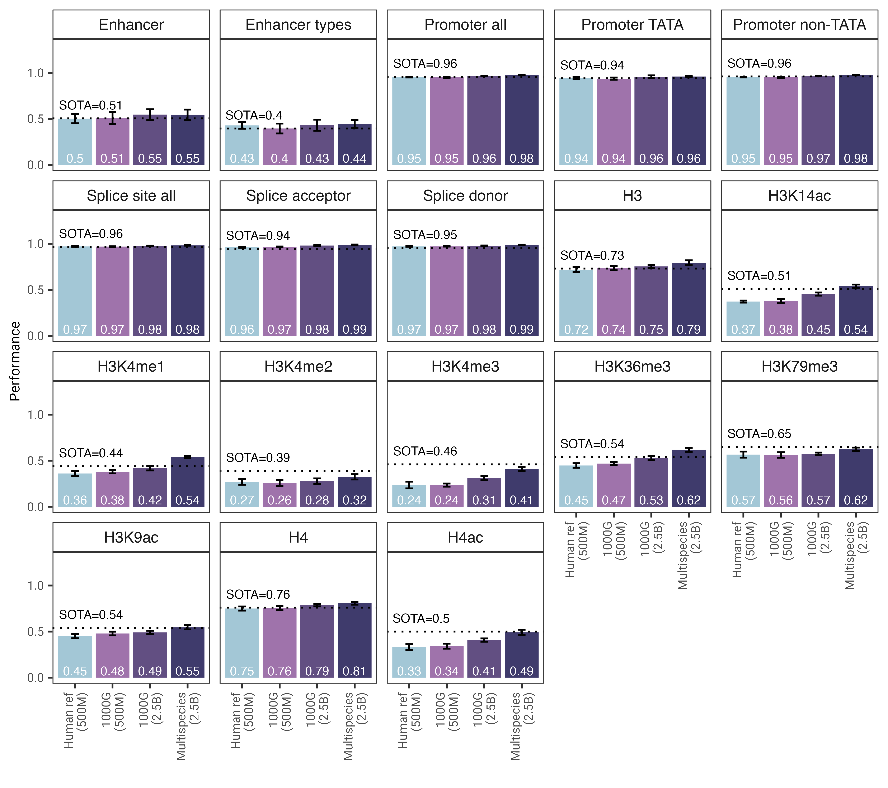

# Nucleotide Transformer

[](https://docs.python.org/3.8/library/index.html)
[](https://jax.readthedocs.io/en/latest/)
[](LICENSE)

Welcome to the InstaDeep Github repository of the [Nucleotide Transformer project](https://www.biorxiv.org/content/10.1101/2023.01.11.523679v1).

We are thrilled to open-source our work in collaboration with Nvidia and TUM and provide the community with access to the code and pre-trained weights for our four genomics language models.

## Description 🧬

we present a comprehensive examination of foundational language models that were pre-trained on DNA sequences from whole-genomes.
Compared to other approaches, our models do not only integrate information from single reference genomes,
but leverage DNA sequences from over 3,200 diverse human genomes, as well as 850 genomes from a wide range of species,
including model and non-model organisms. Through robust and extensive evaluation,
we show that these large models provide extremely accurate molecular phenotype prediction compared to existing methods.



*Fig. 1: The Nucleotide Transformer model matches or outperforms 15 out of 18 downstream tasks using
fine-tuning. We show the performance results across downstream tasks for fine-tuned transformer models. Error bars represent 2 SDs
derived from 10-fold cross-validation. The performance metrics for the state-of-the-art (SOTA) models are shown as horizontal
dotted lines.*

Overall, our work provides novel insights related to the training and application
of language foundational models to genomics with ample opportunities of their applications in the field.

In this repository, you will find the following:

- Inference code for our models
- Pre-trained weights for all four models
- Instructions for using the code and pre-trained models

## Get started 🚀

To use the code and pre-trained models, simply:

1. Clone the repository to your local machine.
2. Install the package by running `pip install .`.

You can then download and do the inference with any of our four models in only a few lines of codes:
```python
import haiku as hk
import jax
import jax.numpy as jnp
from nucleotide_transformer.pretrained import get_pretrained_model

# Get pretrained model
parameters, forward_fn, tokenizer, config = get_pretrained_model(
    model_name="500M_human_ref",
    mixed_precision=False,
    embeddings_layers_to_save=(20,),
    max_positions=32,
)
forward_fn = hk.transform(forward_fn)

# Get data and tokenize it
sequences = ["ATTCCGATTCCGATTCCG", "ATTTCTCTCTCTCTCTGAGATCGATCGATCGAT"]
tokens_ids = [b[1] for b in tokenizer.batch_tokenize(sequences)]
tokens_str = [b[0] for b in tokenizer.batch_tokenize(sequences)]
tokens = jnp.asarray(tokens_ids, dtype=jnp.int32)

# Initialize random key
random_key = jax.random.PRNGKey(0)

# Infer
outs = forward_fn.apply(parameters, random_key, tokens)

# Get embeddings at layer 20
print(outs["embeddings_20"].shape)
```
Supported model names are **500M_human_ref**, **500M_1000G**, **2B5_1000G** and **2B5_multi_species**.

You can also run our models and find more example code in google colab [](https://colab.research.google.com/github/instadeepai/nucleotide-transformer/blob/main/examples/inference.ipynb)

The code runs both on GPU and TPU thanks to Jax!

## Acknowledgments 🙏

We thank Maˇsa Roller, as well as members of the Rostlab, particularly Tobias Olenyi, Ivan Koludarov,
and Burkhard Rost for constructive discussions that helped identify interesting research directions.
Furthermore, we extend gratitude to all those who deposit experimental data in public databases, to
those who maintain these databases, and those who make analytical and predictive methods freely
available. We also thank the Jax development team.

## Citing the Nucleotide Transformer 📚

If you find this repository useful in your work, please add the following citation to our [associated paper](https://www.biorxiv.org/content/10.1101/2023.01.11.523679v1):

```bibtex
@article{dalla2023nucleotide,
  title={The Nucleotide Transformer: Building and Evaluating Robust Foundation Models for Human Genomics},
  author={Dalla-Torre, Hugo and Gonzalez, Liam and Mendoza Revilla, Javier and Lopez Carranza, Nicolas and Henryk Grywaczewski, Adam and Oteri, Francesco and Dallago, Christian and Trop, Evan and Sirelkhatim, Hassan and Richard, Guillaume and others},
  journal={bioRxiv},
  pages={2023--01},
  year={2023},
  publisher={Cold Spring Harbor Laboratory}
}
```

If you have any questions or feedback on the code and models, please feel free to reach out to us.

Thank you for your interest in our work!
