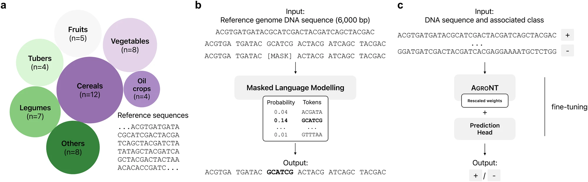
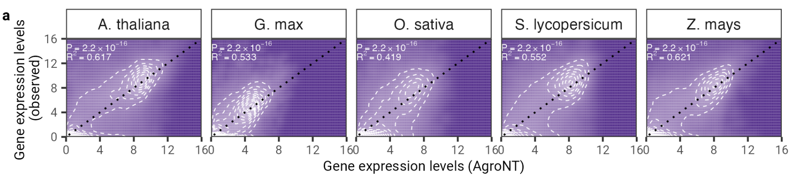

# AgroNT

Agronomic Nucleotide Transformer (AgroNT) is a novel foundational large language model trained on reference genomes from 48 plant species, with a predominant focus on crop species. AgroNT demonstrates state-of-the-art performance across several prediction tasks ranging from regulatory features, RNA processing, and gene expression in plants.

* 📜 **[Read the Paper (Communications Biology 2024)](https://www.nature.com/articles/s42003-024-06465-2)**
* 🤗 **[Hugging Face Collection](https://huggingface.co/collections/InstaDeepAI/agro-nucleotide-transformer-65b25c077cd0069ad6f6d344)**



*Overview of agronomic nucleotide transformer.*



*AgroNT provides gene expression prediction across different plant species. 
Gene expression prediction on holdout genes across all tissues are correlated with observed gene expression levels.

## Model architecture

AgroNT uses the transformer architecture with self-attention and a masked language modeling objective to leverage highly 
available genotype data from 48 different plant speices to learn general representations of nucleotide sequences. 
AgroNT contains 1 billion parameters and has a context window of 1024 tokens. AgroNt uses a non-overlapping 6-mer 
tokenizer to convert genomic nucletoide sequences to tokens. As a result the 1024 tokens correspond to approximately 6144 base pairs.

## Pre-training

### Data
Our pre-training dataset was built from (mostly) edible plants reference genomes contained in the Ensembl Plants database. The dataset consists of approximately 10.5 million genomic sequences across 48 different species.

### Processing
All reference genomes for each specie were assembled into a single fasta file. In this fasta file, all nucleotides other than A, T, C, G were replaced by N. A tokenizer was used to convert strings of letters into sequences of tokens. The tokenizer's alphabet consisted of the 46 = 4096 possible 6-mer combinations obtained by combining A, T, C, G, as well as five additional tokens representing standalone A, T, C, G, and N. It also included three special tokens: the pad [PAD], mask [MASK], and class [CLS] tokens. This resulted in a vocabulary of 4104 tokens. To tokenize an input sequence, the tokenizer started with a class token and then converted the sequence from left to right, matching 6-mer tokens when possible, or using the standalone tokens when necessary (for instance, when the letter N was present or if the sequence length was not a multiple of 6).

### Tokenization example

```python
nucleotide sequence: ATCCCGGNNTCGACACN
tokens: <CLS> <ATCCCG> <G> <N> <N> <TCGACA> <C> <N>
```

### Training
The MLM objective was used to pre-train AgroNT in a self-supervised manner. In a self-supervised learning setting annotations (supervision) for each sequence are not needed as we can mask some proportion of the sequence and use the information contained in the unmasked portion of the sequence to predict the masked locations. This allows us to leverage the vast amount of unlabeled genomic sequencing data available. Specifically, 15% of the tokens in the input sequence are selected to be augmented with 80% being replaced with a mask token, 10% randomly replaced by another token from the vocabulary, and the final 10% maintaining the same token. The tokenized sequence is passed through the model and a cross entropy loss is computed for the masked tokens. Pre-training was carried out with a sequence length of 1024 tokens and an effective batch size of 1.5M tokens for 315k update steps, resulting in the model training on a total of 472.5B tokens.

### Hardware
Model pre-training was carried out using Google TPU-V4 accelerators, specifically a TPU v4-1024 containing 512 devices. We trained for a total of approx. four days.

## How to use 🚀

To use the code and pre-trained models in jax:

```python
import haiku as hk
import jax
import jax.numpy as jnp
from nucleotide_transformer.pretrained import get_pretrained_model

# Get pretrained model
parameters, forward_fn, tokenizer, config = get_pretrained_model(
    model_name="1B_agro_nt",
    embeddings_layers_to_save=(12,),
    max_positions=32,
)
forward_fn = hk.transform(forward_fn)

# Get data and tokenize it
sequences = ["ATTCCGATTCCGATTCCG", "ATTTCTCTCTCTCTCTGAGATCGATCGATCGAT"]
tokens_ids = [b[1] for b in tokenizer.batch_tokenize(sequences)]
tokens = jnp.asarray(tokens_ids, dtype=jnp.int32)

# Initialize random key
random_key = jax.random.PRNGKey(0)

# Infer
outs = forward_fn.apply(parameters, random_key, tokens)

# Get embeddings at layer 20
print(outs["embeddings_12"].shape)
```
You can also run our models and find more example code in `../notebooks/agro_nucleotide_transformer/inference.ipynb`.

The code runs both on GPU and TPU thanks to Jax!

## Citing our work 📚

You can cite our model at:

```bibtex
@article{mendoza2024foundational,
  title={A foundational large language model for edible plant genomes},
  author={Mendoza-Revilla, Javier and Trop, Evan and Gonzalez, Liam and Roller, Ma{\v{s}}a and Dalla-Torre, Hugo and de Almeida, Bernardo P and Richard, Guillaume and Caton, Jonathan and Lopez Carranza, Nicolas and Skwark, Marcin and others},
  journal={Communications Biology},
  volume={7},
  number={1},
  pages={835},
  year={2024},
  publisher={Nature Publishing Group UK London}
}
```