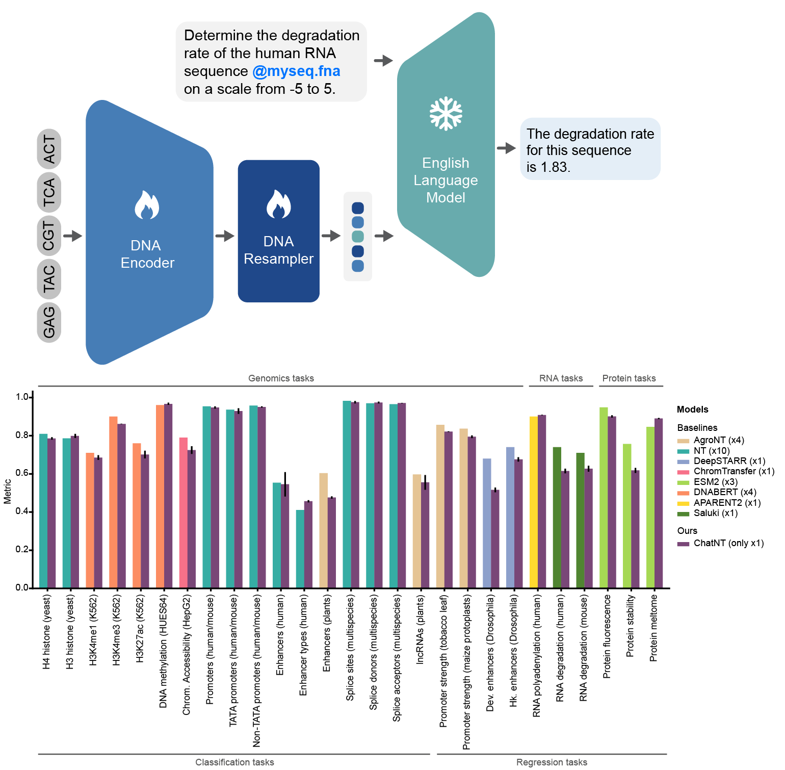

## ChatNT

ChatNT is the first multimodal conversational agent designed with a deep understanding of biological sequences (DNA, RNA, proteins). 
It enables users — even those with no coding background — to interact with biological data through natural language and it generalizes 
across multiple biological tasks and modalities.

* 📜 **[Read the Paper (Nature Machine Intelligence 2025)](https://www.biorxiv.org/content/10.1101/2024.04.30.591835v1)** 
* 🤗 **[ChatNT on Hugging Face](https://huggingface.co/InstaDeepAI/ChatNT)**
* 🚀 **[ChatNT Inference Notebook](../notebooks/chat_nt/inference.ipynb)**



## Architecture and Parameters  
ChatNT is built on a three‑module design: a 500M‑parameter [Nucleotide Transformer v2](https://www.nature.com/articles/s41592-024-02523-z) DNA encoder pre‑trained on genomes from 850 species 
(handling up to 12 kb per sequence, Dalla‑Torre et al., 2024), an English‑aware Perceiver Resampler that linearly projects and gated‑attention compresses 
2048 DNA‑token embeddings into 64 task‑conditioned vectors (REF), and a frozen 7B‑parameter [Vicuna‑7B](https://lmsys.org/blog/2023-03-30-vicuna/) decoder.

Users provide a natural‑language prompt containing one or more `<DNA>` placeholders and the corresponding DNA sequences (tokenized as 6‑mers). 
The projection layer inserts 64 resampled DNA embeddings at each placeholder, and the Vicuna decoder generates free‑form English responses in 
an autoregressive fashion, using low‑temperature sampling to produce classification labels, multi‑label statements, or numeric values.

## Training Data  
ChatNT was instruction‑tuned on a unified corpus covering 27 diverse tasks from DNA, RNA and proteins, spanning multiple species, tissues and biological processes. 
This amounted to 605 million DNA tokens (≈ 3.6 billion bases) and 273 million English tokens, sampled uniformly over tasks for 2 billion instruction tokens.
Examples of questions and sequences for each task, as well as additional task information, can be found in [Datasets_overview.csv](https://huggingface.co/InstaDeepAI/ChatNT/blob/main/Datasets_overview.csv).

## Tokenization  
DNA inputs are broken into overlapping 6‑mer tokens and padded or truncated to 2048 tokens (~ 12 kb). English prompts and 
outputs use the LLaMA tokenizer, augmented with `<DNA>` as a special token to mark sequence insertion points.

## Limitations and Disclaimer  
ChatNT can only handle questions related to the 27 tasks it has been trained on, including the same format of DNA sequences. ChatNT is **not** a clinical or diagnostic tool.
It can produce incorrect or “hallucinated” answers, particularly on out‑of‑distribution inputs, and its numeric predictions may suffer digit‑level errors. Confidence 
estimates require post‑hoc calibration. Users should always validate critical outputs against experiments or specialized bioinformatics 
pipelines.

## How to use 🚀

🔍 The notebook `../notebooks/chat_nt/inference.ipynb` showcases how to generate text from an english input and a DNA sequence.

```python
import haiku as hk
import jax
import jax.numpy as jnp
import numpy as np

from nucleotide_transformer.chatNT.pretrained import get_chatNT

# Initialize CPU as default JAX device. This makes the code robust to memory leakage on
# the devices.
jax.config.update("jax_platform_name", "cpu")

backend = "cpu"
devices = jax.devices(backend)
num_devices = len(devices)

# Load model
forward_fn, parameters, english_tokenizer, bio_tokenizer = get_chatNT()
forward_fn = hk.transform(forward_fn)

# Replicate over devices
apply_fn = jax.pmap(forward_fn.apply, devices=devices, donate_argnums=(0,))
random_key = jax.random.PRNGKey(seed=0)
keys = jax.device_put_replicated(random_key, devices=devices)
parameters = jax.device_put_replicated(parameters, devices=devices)

# Define prompt
english_sequence = "A chat between a curious user and an artificial intelligence assistant that can handle bio sequences. The assistant gives helpful, detailed, and polite answers to the user's questions. USER: Is there any evidence of an acceptor splice site in this sequence <DNA> ? ASSISTANT:"
dna_sequences = ["A"*600]

# Tokenize
english_tokens = english_tokenizer(
    [english_sequence],
    return_tensors="np",
    max_length=english_max_length,
    padding="max_length",
    truncation=True,
).input_ids
bio_tokens = bio_tokenizer(
    dna_sequences,
    return_tensors="np",
    padding="max_length",
    max_length=bio_tokenized_sequence_length,
    truncation=True,
).input_ids
bio_tokens = np.expand_dims(bio_tokens, axis=0) # add batch size dimension

# Replicate over devices
english_tokens = jnp.stack([jnp.asarray(english_tokens, dtype=jnp.int32)]*num_devices, axis=0)
bio_tokens = jnp.stack([jnp.asarray(bio_tokens, dtype=jnp.int32)]*num_devices, axis=0)

# Infer
outs = apply_fn(
    parameters,
    keys,
    multi_omics_tokens_ids=(english_tokens, bio_tokens),
    projection_english_tokens_ids=english_tokens,
)

# Obtain the logits
logits = outs["logits"]
```

## Citing our work 📚

You can cite our model at:

[ChatNT paper](https://www.nature.com/articles/s42256-025-01047-1)
```bibtex
@article{dealmeida2024chatnt,
  title={A multimodal conversational agent for dna, rna and protein tasks},
  author={de Almeida, Bernardo P and Richard, Guillaume and Dalla-Torre, Hugo and Blum, Christopher and Hexemer, Lorenz and Pandey, Priyanka and Laurent, Stefan and others},
  journal={Nature Machine Intelligence},
  year={2025},
}
```