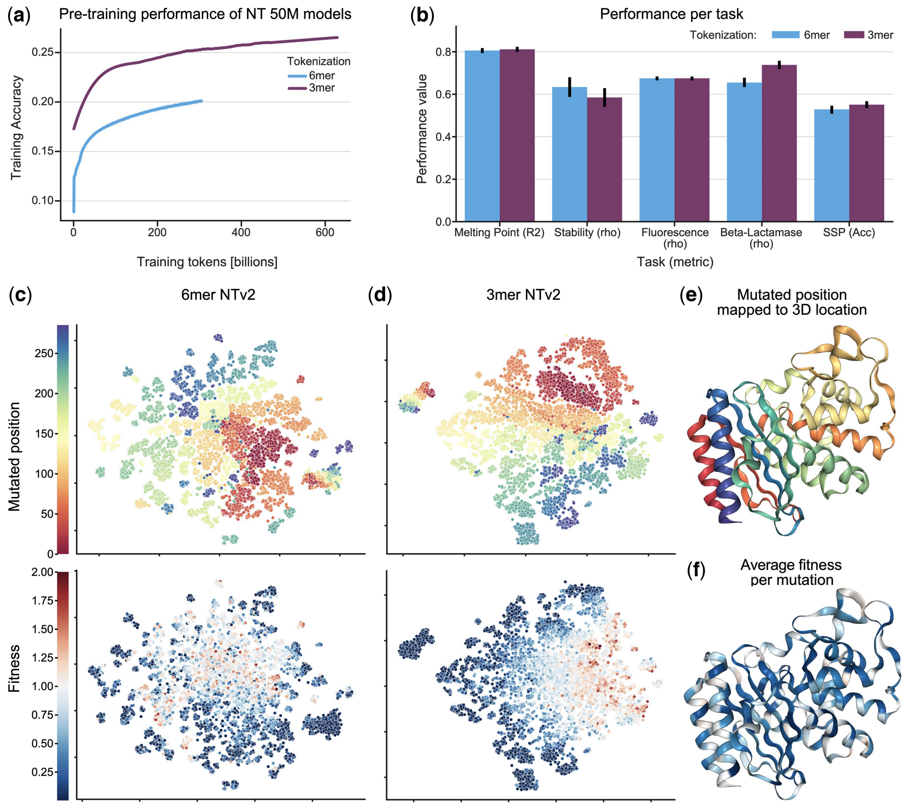

# Codon-NT

Condon-NT is a Nucleotide Transformer model variant trained on 3-mers (codons). 
It is a 50M parameters transformer pre-trained on a collection of 850 genomes from a wide range of species, including model and non-model organisms. 
This work investigates alternative tokenization strategies for genomic language models and their impact on downstream performance and interpretability.

* 📜 **[Read the Paper (Bioinformatics 2024)](https://academic.oup.com/bioinformatics/article/40/9/btae529/7745814)**
* 🤗 **[Hugging Face Link](https://huggingface.co/InstaDeepAI/nucleotide-transformer-v2-50m-3mer-multi-species)**



*3mer tokenization achieves better performance than 6-mer on specific protein tasks*

## Training data

The nucleotide-transformer-v2-50m-3mer-multi-species model was pretrained on a total of 850 genomes downloaded from NCBI. Plants and viruses are not included in these genomes, as their regulatory elements differ from those of interest in the paper's tasks. Some heavily studied model organisms were picked to be included in the collection of genomes, which represents a total of 174B nucleotides, i.e roughly 29B tokens. The data has been released as a HuggingFace dataset here.

## Training detals

### Data pre-rocessing
The DNA sequences are tokenized using the Nucleotide Transformer Tokenizer, which tokenizes sequences as 6-mers tokenizer when possible, otherwise tokenizing each nucleotide separately as described in the Tokenization section of the associated repository. This tokenizer has a vocabulary size of 4105. The inputs of the model are then of the form:

<CLS> <ACGTGT> <ACGTGC> <ACGGAC> <GACTAG> <TCAGCA>

The tokenized sequence have a maximum length of 1,000.

The masking procedure used is the standard one for Bert-style training:

15% of the tokens are masked.
In 80% of the cases, the masked tokens are replaced by [MASK].
In 10% of the cases, the masked tokens are replaced by a random token (different) from the one they replace.
In the 10% remaining cases, the masked tokens are left as is.

### Pre-training
The model was trained with 64 TPUv4s on 300B tokens, with an effective batch size of 1M tokens. The sequence length used was 1000 tokens. The Adam optimizer [38] was used with a learning rate schedule, and standard values for exponential decay rates and epsilon constants, β1 = 0.9, β2 = 0.999 and ε=1e-8. During a first warmup period, the learning rate was increased linearly between 5e-5 and 1e-4 over 16k steps before decreasing following a square root decay until the end of training.

### Model architecture
The model belongs to the second generation of nucleotide transformers, with the changes in architecture consisting the use of rotary positional embeddings instead of learned ones, as well as the introduction of Gated Linear Units.

## Available Resources

Benchmark datasets https://huggingface.co/datasets/InstaDeepAI/true-cds-protein-tasks.

## How to use 🚀

To use the code and pre-trained models in jax:

```python
import haiku as hk
import jax
import jax.numpy as jnp
from nucleotide_transformer.pretrained import get_pretrained_model

# Get pretrained model
parameters, forward_fn, tokenizer, config = get_pretrained_model(
    model_name="codon_nt",
    embeddings_layers_to_save=(12,),
    max_positions=32,
)
forward_fn = hk.transform(forward_fn)

# Get data and tokenize it
sequences = ["ATTCCGATTCCGATTCCG", "ATTTCTCTCTCTCTCTGAGATCGATCGATCGAT"]
tokens_ids = [b[1] for b in tokenizer.batch_tokenize(sequences)]
tokens = jnp.asarray(tokens_ids, dtype=jnp.int32)

# Initialize random key
random_key = jax.random.PRNGKey(0)

# Infer
outs = forward_fn.apply(parameters, random_key, tokens)

# Get embeddings at layer 20
print(outs["embeddings_12"].shape)
```
You can also run our models and find more example code in `../notebooks/codon_nt/inference.ipynb`.

The code runs both on GPU and TPU thanks to Jax!

## Citing our work 📚

You can cite our model at:

```bibtex
@article{10.1093/bioinformatics/btae529,
    author = {Boshar, Sam and Trop, Evan and de Almeida, Bernardo P and Copoiu, Liviu and Pierrot, Thomas},
    title = {Are genomic language models all you need? Exploring genomic language models on protein downstream tasks},
    journal = {Bioinformatics},
    volume = {40},
    number = {9},
    pages = {btae529},
    year = {2024},
    month = {08},
}
```
