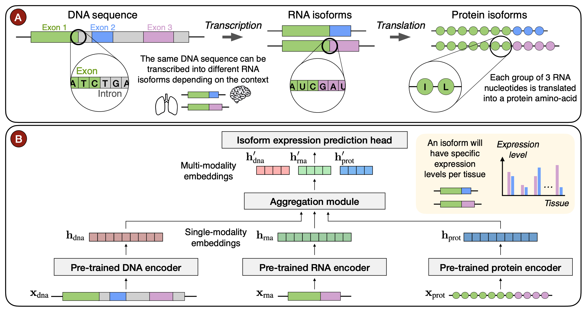

# Isoformer

Isoformer is a model able to accurately predict differential transcript expression, outperforming existing methods and leveraging the use of multiple modalities. 
Our framework achieves efficient transfer knowledge from three pre-trained encoders: Enformer for the DNA modality, Nucleotide Transformer v2 for 
the RNA modality and ESM2 for the protein modality.

* 📜 **[Read the Paper (NeurIPS 2024)](https://papers.nips.cc/paper_files/paper/2024/file/8f6b3692297e49e5d5c91ba00281379c-Paper-Conference.pdf)**
* 🤗 **[Hugging Face Link](https://huggingface.co/InstaDeepAI/isoformer)**
* 🚀 **[Isoformer Inference Notebook (HF)](../notebooks/isoformer/inference.ipynb)**



# Training data

Isoformer is trained on RNA transcript expression data obtained from the GTex portal, 
namely Transcript TPMs measurements across 30 tissues which come from more than 5000 individuals. 
In total, the dataset is made of ∼170k unique transcripts, of which 90k are protein-coding and correspond to ∼20k unique genes.

## How to use 🚀

We make Isoformer available on HuggingFace and provide an example on how to use it at `./notebooks/isoformer/inference.ipynb`.

## Citing our work 📚

You can cite our model at:

```bibtex
@inproceedings{NEURIPS2024_8f6b3692,
 author = {Garau-Luis, Juan Jose and Bordes, Patrick and Gonzalez, Liam and Roller, Masa and de Almeida, Bernardo P. and Hexemer, Lorenz and Blum, Christopher and Laurent, Stefan and Grzegorzewski, Jan and Lang, Maren and Pierrot, Thomas and Richard, Guillaume},
 booktitle = {Advances in Neural Information Processing Systems},
 editor = {A. Globerson and L. Mackey and D. Belgrave and A. Fan and U. Paquet and J. Tomczak and C. Zhang},
 pages = {78431--78450},
 publisher = {Curran Associates, Inc.},
 title = {Multi-modal Transfer Learning between Biological Foundation Models},
 url = {https://proceedings.neurips.cc/paper_files/paper/2024/file/8f6b3692297e49e5d5c91ba00281379c-Paper-Conference.pdf},
 volume = {37},
 year = {2024}
}
```
