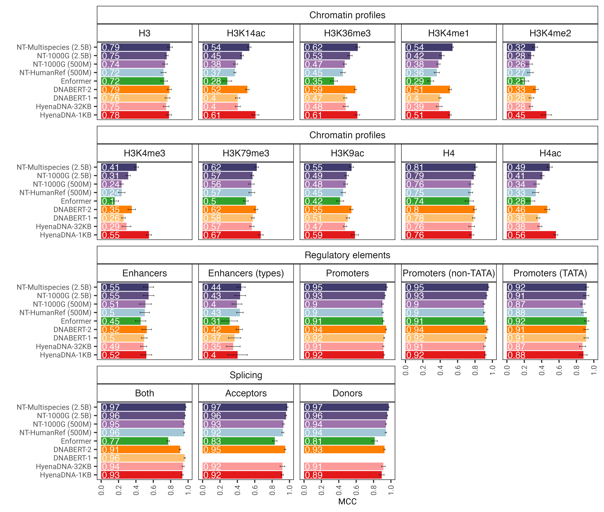

# Nucleotide Transformer

The Nucleotide Transformer (NT) project addresses the challenge of predicting molecular phenotypes from DNA by developing 
large-scale foundation models pre-trained on extensive DNA sequences. 
These models aim to learn general-purpose representations of DNA, overcoming limitations of 
task-specific models and data scarcity, similar to how models like BERT and GPT revolutionized natural language processing.   

Compared to other approaches, our models do not only integrate information from single reference genomes,
but leverage DNA sequences from over 3,200 diverse human genomes, as well as 850 genomes from a wide range of species,
including model and non-model organisms. Through robust and extensive evaluation,
we show that these large models provide extremely accurate molecular phenotype prediction compared to existing methods.

* 📜 **[Read the Paper (Nature Methods 2025)](https://www.nature.com/articles/s41592-024-02523-z)**
* 🤗 **[Hugging Face Collection](https://huggingface.co/collections/InstaDeepAI/nucleotide-transformer-65099cdde13ff96230f2e592)**
* 🚀 **Fine-tuning Notebooks (HF): ([LoRA](https://github.com/huggingface/notebooks/blob/main/examples/nucleotide_transformer_dna_sequence_modelling_with_peft.ipynb) and [regular](https://github.com/huggingface/notebooks/blob/main/examples/nucleotide_transformer_dna_sequence_modelling.ipynb))**




*The Nucleotide Transformer model accurately predicts diverse genomics tasks
after fine-tuning. We show the performance results across downstream tasks for fine-tuned transformer models. Error bars represent 2 SDs derived from 10-fold cross-validation.*

## Model Variants and Sizes

NT models are transformer-based, varying in size (50 million to 2.5 billion parameters) and pre-training data. 
Two main sets of NT models were developed:

1 - Initial NT Models (NT-v1): This first generation of models explored a range of parameter sizes and pre-training data sources:
- Human ref 500M: A 500-million-parameter model trained on the human reference genome (GRCh38/hg38).
- 1000G 500M: A 500-million-parameter model trained on 3,202 diverse human genomes from the 1000 Genomes Project.
- 1000G 2.5B: A 2.5-billion-parameter model, also trained on the 3,202 genomes from the 1000 Genomes Project.
- Multispecies 2.5B: A 2.5-billion-parameter model trained on a diverse collection of 850 genomes from various species, including 11 model organisms.

2 - Optimized NT Models (NT-v2): Following insights from the initial models, a second set of four models was developed, focusing on parameter efficiency and architectural advancements. These models range from 50 million to 500 million parameters. 
- Our second version Nucleotide Transformer v2 models include a series of architectural changes that proved more efficient: instead of using learned positional embeddings, we use Rotary Embeddings that are used at each attention layer and Gated Linear Units with swish activations without bias. These improved models also accept sequences of up to 2,048 tokens leading to a longer context window of 12kbp.
- Inspired by Chinchilla scaling laws, we also trained our NT-v2 models on our multi-species dataset for longer duration (300B tokens for the 50M and 100M models; 1T tokens for the 250M and 500M model) compared to the v1 models (300B tokens for all four models).
- NT-v2 models were all pre-trained on the multispecies dataset

Both type of models are encoder-only transformers tokenizing DNA into 6-mers (4,104 total tokens including special ones). 
NT-v1 used learnable positional encodings for a 6kb context. 
NT-v2 models incorporated rotary positional embeddings (RoPE), SwiGLU activations, removed biases and dropout, and extended context length to 12kb.

## Available Resources

Pre-training datasets, models and downstream tasks can be found on our [HuggingFace space](https://huggingface.co/collections/InstaDeepAI/nucleotide-transformer-65099cdde13ff96230f2e592).  
Interactive Leaderboard on downstream tasks is available at https://huggingface.co/spaces/InstaDeepAI/nucleotide_transformer_benchmark.

## Tokenization :abc:

The models are trained on sequences of length up to 1000 (NT-v1) and 2000 (NT-v1) tokens, including the
\<CLS> token prepended automatically to the beginning of the sequence. The tokenizer
starts tokenizing from left to right by grouping the letters "A", "C", "G" and "T" in
6-mers. The "N" letter is chosen not to be grouped inside the k-mers, therefore
whenever the tokenizer encounters a "N", or if the number of nucleotides in the sequence
is not a multiple of 6, it will tokenize the nucleotides without grouping them. Examples
are given below:

```python
dna_sequence_1 = "ACGTGTACGTGCACGGACGACTAGTCAGCA"
tokenized_dna_sequence_1 = [<CLS>,<ACGTGT>,<ACGTGC>,<ACGGAC>,<GACTAG>,<TCAGCA>]

dna_sequence_2 = "ACGTGTACNTGCACGGANCGACTAGTCTGA"
tokenized_dna_sequence_2 = [<CLS>,<ACGTGT>,<A>,<C>,<N>,<TGCACG>,<G>,<A>,<N>,<CGACTA>,<GTCTGA>]
```

All the v1 and v2 transformers can therefore take sequences of up to 5994 and 12282 nucleotides respectively if there are
no "N" inside.

## How to use 🚀

To use the code and pre-trained models in jax:

```python
import haiku as hk
import jax
import jax.numpy as jnp
from nucleotide_transformer.pretrained import get_pretrained_model

# Get pretrained model
parameters, forward_fn, tokenizer, config = get_pretrained_model(
    model_name="250M_multi_species_v2",
    embeddings_layers_to_save=(20,),
    max_positions=32,
)
forward_fn = hk.transform(forward_fn)

# Get data and tokenize it
sequences = ["ATTCCGATTCCGATTCCG", "ATTTCTCTCTCTCTCTGAGATCGATCGATCGAT"]
tokens_ids = [b[1] for b in tokenizer.batch_tokenize(sequences)]
tokens = jnp.asarray(tokens_ids, dtype=jnp.int32)

# Initialize random key
random_key = jax.random.PRNGKey(0)

# Infer
outs = forward_fn.apply(parameters, random_key, tokens)

# Get embeddings at layer 20
print(outs["embeddings_20"].shape)
```
Supported model names are:
- **500M_human_ref**
- **500M_1000G**
- **2B5_1000G**
- **2B5_multi_species**
- **50M_multi_species_v2**
- **100M_multi_species_v2**
- **250M_multi_species_v2**
- **500M_multi_species_v2**

You can also run our models and find more example code in `../notebooks/nucleotide_transformer/inference.ipynb`.

The code runs both on GPU and TPU thanks to Jax!

### Embeddings retrieval
The transformer layers are 1-indexed, which means that calling `get_pretrained_model` with the arguments `model_name="500M_human_ref"` and `embeddings_layers_to_save=(1, 20,)` will result in extracting embeddings after the first and 20-th transformer layer. For transformers using the Roberta LM head, it is common practice to extract the final embeddings after the first layer norm of the LM head rather than after the last transformer block. Therefore, if `get_pretrained_model` is called with the following arguments `embeddings_layers_to_save=(24,)`, the embeddings will not be extracted after the final transformer layer but rather after the first layer norm of the LM head.


## Citing our work 📚

You can cite our model at:

```bibtex
@article{dalla2025nucleotide,
  title={Nucleotide Transformer: building and evaluating robust foundation models for human genomics},
  author={Dalla-Torre, Hugo and Gonzalez, Liam and Mendoza Revilla, Javier and Lopez Carranza, Nicolas and Henryk Grywaczewski, Adam and Oteri, Francesco and Dallago, Christian and Trop, Evan and de Almeida, Bernardo P and Sirelkhatim, Hassan and Richard, Guillaume and others},
  journal={Nature Methods},
  volume={22},
  pages={287-297},
  year={2025},
  publisher={Nature Publishing Group UK London}
}
```
