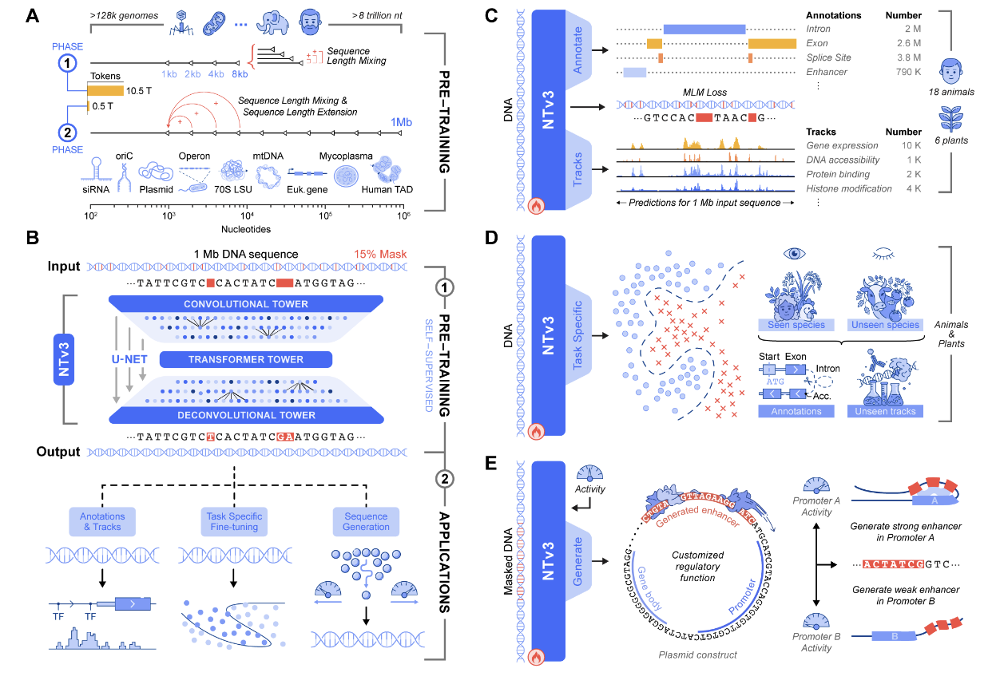
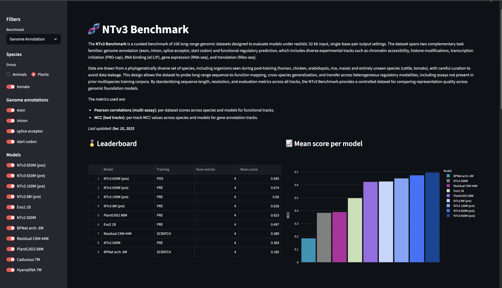

# 🧬 Nucleotide Transformer v3 (NTv3)

The Nucleotide Transformer v3 (NTv3) is a **multi-species genomics foundation model** that unifies representation learning, functional-track prediction, genome annotation, and controllable sequence generation within a single framework. Unlike existing specialized approaches, NTv3 combines **long-context modeling (up to 1 Mb)**, **base-resolution prediction**, and **controllable generation** across organisms and modalities.

NTv3 uses a **U-Net-like architecture** with **single-base tokenization**, enabling efficient processing of million-nucleotide contexts at nucleotide resolution. We pretrain on **9 trillion base pairs** from OpenGenome2 using masked language modeling, followed by post-training with a joint objective that integrates continued self-supervision with supervised learning on **~16,000 functional tracks** and annotation labels from **24 animal and plant species**.

After post-training, NTv3 achieves **state-of-the-art accuracy** for functional-track prediction and genome annotation, outperforming leading baselines on established benchmarks and on **NTv3 Benchmark (NTv3Bench)**, our new controlled fine-tuning suite with 32 kb inputs and base-resolution outputs. We further demonstrate that NTv3 can be fine-tuned into a **controllable generative model** via masked diffusion, enabling design of enhancer sequences with specified activity levels—validated experimentally via STARR-seq *in cellulo*.

---

<p align="center">
  <strong>📜 <a href="https://www.biorxiv.org/content/10.64898/2025.12.22.695963v1">Read the Paper</a></strong> &nbsp;•&nbsp;
  <strong>🚀 <a href="https://huggingface.co/spaces/InstaDeepAI/ntv3">Hugging Face Space</a></strong> &nbsp;•&nbsp;
  <strong>🗒️ <a href="../notebooks/nucleotide_transformer_v3">Notebook Tutorials</a></strong> &nbsp;•&nbsp;
  <strong>🧪 <a href="#-ntv3-benchmark">NTv3Bench</a></strong>
</p>

---

<p align="center">
  
</p>

<p align="center"><em><strong>Overview:</strong> (A) Pre-training on OpenGenome2 using a two-phase curriculum with sequence-length mixing. (B) Core U-Net-style architecture for 1 Mb, single-bp modeling. (C) Multispecies post-training on functional tracks and genome annotations. (D) Supervised fine-tuning on diverse downstream tasks. (E) Generative extension via masked diffusion for controllable enhancer design.</em></p>

---

## 📑 Table of Contents

1. [🎯 Training Overview](#-training-overview)
2. [✨ Key Capabilities](#-key-capabilities)
3. [📦 Model Variants and Sizes](#-model-variants-and-sizes)
4. [🔬 Ablations and Intermediate Checkpoints](#-ablations-and-intermediate-checkpoints)
5. [🏗️ Architecture](#️-architecture)
6. [🔤 Tokenization](#-tokenization)
7. [🚀 How to Use](#-how-to-use)
8. [📏 Sequence Length Requirements](#-sequence-length-requirements)
9. [🧪 NTv3 Benchmark](#-ntv3-benchmark)
10. [📚 Citing Our Work](#-citing-our-work)

---

## 🎯 Training Overview

NTv3 is trained in two stages:

1. **Pre-training:** Trained on **9 trillion base pairs** from OpenGenome2 using base-resolution masked language modeling (MLM), scaling context to 1 Mb through a length curriculum and mixed-length training.

2. **Post-training:** Joint objective integrating continued self-supervision with supervised learning on **~16,000 functional tracks** and annotation labels from **24 animal and plant species**.

> [!TIP]
> After post-training, NTv3 achieves **state-of-the-art accuracy** for functional-track prediction and genome annotation across species, outperforming leading sequence-to-function and foundation-model baselines. Notably, NTv3 is the **first sequence-to-function-at-scale model extended to the plant regime**, enabling base-resolution prediction of ~6,000 functional tracks across key plant species.

---

## ✨ Key Capabilities

| | Capability | Description |
|:---:|:---|:---|
| 🧬 | **Self-Supervised Genome Modeling** | Via masked language modeling, yielding representations and variant-effect probabilities for comprehensive genome understanding. |
| 📊 | **Supervised Genome-to-Function Prediction** | Functional-track heads enable prediction of **~16,000 tracks across 24 species**, covering chromatin accessibility, histone modifications, and transcription factor binding. |
| 🎯 | **Base-Resolution Genome Annotation** | Segmentation heads provide precise, base-resolution genome-annotation prediction for gene elements and regulatory regions. |
| 🎨 | **Controllable Generative Modeling** | Fine-tune NTv3 into a controllable generative model through the masked-diffusion language modeling (MDLM) paradigm for sequence design tasks. |

---

## 📦 Model Variants and Sizes

### Pre-trained Models

Pre-trained models using masked language modeling on OpenGenome2 with context length ≤1 Mb:

| Model | Parameters |
|:------|:-----------|
| **[NTv3_8M_pre](https://huggingface.co/InstaDeepAI/NTv3_8M_pre)** | 8M |
| **[NTv3_100M_pre](https://huggingface.co/InstaDeepAI/NTv3_100M_pre)** | 100M |
| **[NTv3_650M_pre](https://huggingface.co/InstaDeepAI/NTv3_650M_pre)** | 650M |

### Post-trained Models

Post-trained models extend pre-trained models with supervised objectives for functional tracks and genome annotations across 24 species:

| Model | Parameters |
|:------|:-----------|
| **[NTv3_100M_post](https://huggingface.co/InstaDeepAI/NTv3_100M_post)** | 100M |
| **[NTv3_650M_post](https://huggingface.co/InstaDeepAI/NTv3_650M_post)** | 650M |

**These models can predict:**
- **Functional tracks** (BigWig): ~16,000 tracks including chromatin accessibility, histone modifications, and transcription factor binding
- **Genome annotations** (BED): Gene elements, regulatory regions, and more

---

## 🔬 Ablations and Intermediate Checkpoints

> [!NOTE]
> In addition to the main production models, we provide intermediate checkpoints and ablation variants for research purposes.

| Model | Params | Downsamples | Stage | Max Context | Notes |
|:------|:-------|:------------|:------|:------------|:------|
| **[NTv3_8M_pre_8kb](https://huggingface.co/InstaDeepAI/NTv3_8M_pre_8kb)** | 8M | 7 | Pre | 8kb | Checkpoint after first stage of pre-training |
| **[NTv3_100M_pre_8kb](https://huggingface.co/InstaDeepAI/NTv3_100M_pre_8kb)** | 100M | 7 | Pre | 8kb | Checkpoint after first stage of pre-training |
| **[NTv3_100M_post_131kb](https://huggingface.co/InstaDeepAI/NTv3_100M_post_131kb)** | 100M | 7 | Post | 131kb | Checkpoint after second stage of post-training |
| **[NTv3_650M_pre_8kb](https://huggingface.co/InstaDeepAI/NTv3_650M_pre_8kb)** | 650M | 7 | Pre | 8kb | Checkpoint after first stage of pre-training |
| **[NTv3_650M_post_131kb](https://huggingface.co/InstaDeepAI/NTv3_650M_post_131kb)** | 650M | 7 | Post | 131kb | Checkpoint after first stage of post-training |

### 5 Downsample Models (Experimental)

These models are experimental and not used in the main paper results.

| Model | Params | Downsamples | Stage | Max Context | Notes |
|:------|:-------|:------------|:------|:------------|:------|
| **[NTv3_5downsample_pre_8kb](https://huggingface.co/InstaDeepAI/NTv3_5downsample_pre_8kb)** | 592M | 5 | Pre | 8kb | Checkpoint after first stage |
| **[NTv3_5downsample_pre](https://huggingface.co/InstaDeepAI/NTv3_5downsample_pre)** | 592M | 5 | Pre | 1Mb | Full pre-trained model |
| **[NTv3_5downsample_post_131kb](https://huggingface.co/InstaDeepAI/NTv3_5downsample_post_131kb)** | 592M | 5 | Post | 131kb | Checkpoint after second stage |
| **[NTv3_5downsample_post](https://huggingface.co/InstaDeepAI/NTv3_5downsample_post)** | 592M | 5 | Post | 1Mb | Full post-trained model |

> [!NOTE]
> - **Stage:** "Pre" = pre-trained (MLM only), "Post" = post-trained (MLM + supervised objectives)
> - **Downsamples:** 7 downsamples require sequence length divisible by 128; 5 downsamples require divisible by 32

---

## 🏗️ Architecture

NTv3 employs a U-Net-like architecture optimized for long-range genomic modeling:

1. **Single-base tokenization:** Each nucleotide (A, T, C, G, N) is tokenized individually, enabling true base-pair resolution
2. **Convolutional downsampling tower:** Reduces sequence length by $2^n$ where $n$ = `num_downsamples` through convolutions
3. **Transformer core:** Processes the compressed representation with self-attention
4. **Deconvolutional upsampling tower:** Restores original sequence resolution with skip connections
5. **Species-conditioning:** Adaptive layer norms for multi-species support

This design enables **efficient processing of sequences up to 1 Mb** while maintaining **single-nucleotide resolution outputs**.

---

## 🔤 Tokenization

Unlike previous Nucleotide Transformer versions that use 6-mer tokenization, NTv3 uses **single-base tokenization**:

```python
# Standard nucleotide vocabulary
standard_tokens = ["A", "T", "C", "G", "N"]

# Special tokens
special_tokens = ["<unk>", "<pad>", "<mask>", "<cls>", "<eos>", "<bos>"]

# Example tokenization
dna_sequence = "ACGTACGT"
tokenized = ["A", "C", "G", "T", "A", "C", "G", "T"]
```

> [!IMPORTANT]
> The sequence length must be divisible by 2^num_downsamples for the U-Net architecture to work correctly. For a model with 7 downsampling layers, the sequence length must be divisible by 128.

---

## 🚀 How to Use

### Pre-trained Models

To use the pre-trained models in JAX:

```python
import jax.numpy as jnp
from nucleotide_transformer_v3.pretrained import get_pretrained_ntv3_model

# Get pretrained model
model, tokenizer, config = get_pretrained_ntv3_model(
    model_name="NTv3_100M_pre",
    embeddings_layers_to_save=(10,),
)

# Get data and tokenize it
sequences = ["ATTCCGATTCCGATTCCG", "ATTTCTCTCTCTCTCTGAGATCGATCGATCGAT"]
tokens = tokenizer.batch_np_tokenize(sequences)

# Infer
outs = model(tokens)

# Get embeddings at layer 10
print(outs["embeddings_10"].shape)
```

### Post-trained Models

Post-trained models require species conditioning and can predict functional tracks and genome annotations:

```python
import jax.numpy as jnp
from nucleotide_transformer_v3.pretrained import get_posttrained_ntv3_model

# Get post-trained model
posttrained_model, tokenizer, config = get_posttrained_ntv3_model(
    model_name="NTv3_100M_post",
)

# Get data and tokenize it - 2 sequences of length 2**15 (32768 nucleotides)
seq_length = 2**15  # 32768
sequences = ["A" * seq_length, "T" * seq_length]  # 2 sequences
tokens = tokenizer.batch_np_tokenize(sequences)

# Get species token from conditions vocabulary
species = 'human'
species_tokens = posttrained_model.encode_species(species)

# Infer - file_assembly_indices is computed internally from species condition
outs = posttrained_model(
    tokens=tokens,
    species_tokens=species_tokens,
)

# Get predictions
# NOTE: The post-trained model crops bigwig and bed track outputs to the middle 37.5%
# of the sequence (Borzoi/AlphaGenome style), while MLM logits remain at full length.
# For seq_length=32768: cropped_length = int(32768 * 0.375) = 12288

logits = outs["logits"]  # Language model predictions (NOT cropped)
# logits shape: (batch_size=2, token_seq_length, vocab_size)

bigwig_logits = outs["bigwig_tracks_logits"]  # Functional track predictions (cropped)
# bigwig_logits shape: (batch_size=2, cropped_token_seq_length, num_bigwig_tracks)

bed_logits = outs["bed_tracks_logits"]  # Genome annotation predictions (cropped)
# bed_logits shape: (batch_size=2, cropped_token_seq_length, num_bed_elements, 2)

print(f"logits shape: {logits.shape}")  # Full sequence length
print(f"bigwig_logits shape: {bigwig_logits.shape}")  # Cropped to middle 37.5%
print(f"bed_logits shape: {bed_logits.shape}")  # Cropped to middle 37.5%
```

> [!TIP]
> - You can also run our models and find more example code in [`../notebooks/nucleotide_transformer_v3/`](../notebooks/nucleotide_transformer_v3/).
> - ⚡ The code runs both on **GPU and TPU** thanks to JAX!

### Memory Optimization with bfloat16

Both `get_pretrained_ntv3_model()` and `get_posttrained_ntv3_model()` support a `use_bfloat16` parameter to reduce memory usage:

```python
# Use bfloat16 precision for reduced memory usage
model, tokenizer, config = get_pretrained_ntv3_model(
    model_name="NTv3_100M_pre",
    use_bfloat16=True,  # Enable bfloat16 precision
)
```

> [!NOTE]
> For memory considerations, the NTv3 family was trained with all compute and parameter dtypes set to bfloat16. You can choose to enable or disable bfloat16 precision during inference via the `use_bfloat16` parameter. We observe only very small differences in inference results between bfloat16 and full precision modes.
> 
> See [`set_bfloat16_dtypes()`](../nucleotide_transformer_v3/pretrained.py#L416) for the complete list of parameters that are set to bfloat16.


## 📏 Sequence Length Requirements

> [!WARNING]
> Due to the U-Net architecture which uses downsampling and upsampling layers, sequence lengths must be divisible by 2^num_downsamples. For the main models, this is **128 for 7 downsamples**.
>
> If your sequences don't meet this requirement, you can crop them to the nearest valid length, or pad them with `N` tokens to the nearest valid length. **The models however were not trained on [PAD] tokens**, so you should not pad them with [PAD] tokens.

---

## 🧪 NTv3 Benchmark

We introduce **NTv3 Benchmark**, a new large-scale benchmark comprising **106 distinct tasks**, each formulated on natural long-range inputs (32 kb) with base-pair-resolution outputs. The benchmark:

- ✅ Enables realistic genome-wide evaluation for both annotation and functional readouts
- ✅ Spans a broad collection of new assays and new species
- ✅ Is constructed under strict data-leakage controls relative to our post-training corpus

**NTv3 Benchmark** provides a standardized framework for assessing cross-assay and cross-species generalization at scale.

### 🚀 [Try NTv3 Benchmark on Hugging Face](https://huggingface.co/spaces/InstaDeepAI/ntv3_benchmark)

<p align="center">
  
</p>

---

## 📚 Citing Our Work

```bibtex
@article{ntv3_2025,
  title={A foundational model for joint sequence-function multi-species modeling at scale for long-range genomic prediction},
  author={Boshar, Sam and Evans, Benjamin and Tang, Ziqi and Picard, Armand and Adel, Yanis and Lorbeer, Franziska K. and Rajesh, Chandana and Karch, Tristan and Sidbon, Shawn and Emms, David and Mendoza-Revilla, Javier and Al-Ani, Fatimah and Seitz, Evan and Schiff, Yair and Bornachot, Yohan and Hernandez, Ariana and Lopez, Marie and Laterre, Alexandre and Beguir, Karim and Koo, Peter and Kuleshov, Volodymyr and Stark, Alexander and de Almeida, Bernardo P. and Pierrot, Thomas},
  journal={bioRxiv},
  year={2025}
}
```
