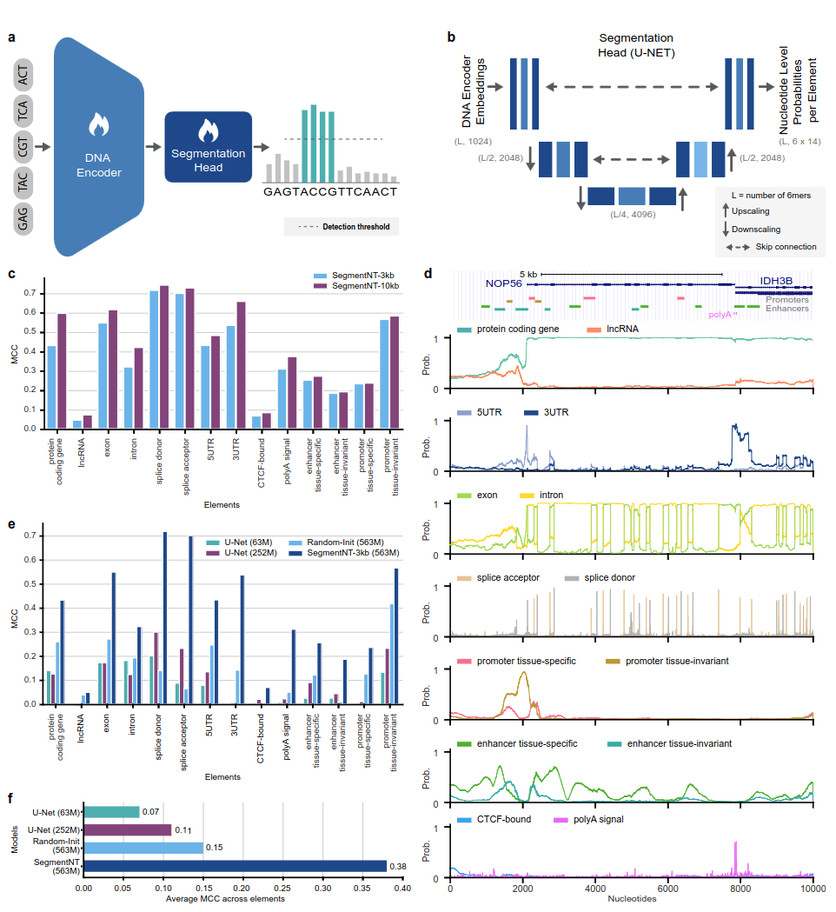

## Segmentation models

Segmentation models using transformer backbones (Nucleotide Transformers, Enformer, Borzoi) for predicting genomic elements at single-nucleotide resolution. SegmentNT, for instance, predicts 14 different classes of human genomic elements in sequences up to 30kb (generalizing to 50kbp) and demonstrates superior performance.

All models are used with a 1-dimensional U-Net segmentation head to predict the location of several types of genomics elements in a sequence at a single nucleotide resolution. These include gene (protein-coding genes, lncRNAs, 5’UTR, 3’UTR, exon, intron, splice acceptor and donor sites) and regulatory (polyA signal, tissue-invariant and tissue-specific promoters and enhancers, and CTCF-bound sites) elements. 

* 📜 **[Read the Paper (bioRxiv preprint)](https://www.biorxiv.org/content/10.1101/2024.03.14.584712v1)**
* 🤗 **[SegmentNT Hugging Face Collection](https://huggingface.co/collections/InstaDeepAI/segmentnt-65eb4941c57808b4a3fe1319)**
* 🚀 **[SegmentNT Inference Notebook (HF)](https://colab.research.google.com/#fileId=https%3A//huggingface.co/InstaDeepAI/segment_nt/blob/main/inference_segment_nt.ipynb)**



*Fig. 1: SegmentNT localizes genomics elements at nucleotide resolution.*

## How to use 🚀

### SegmentNT

⚠️ The SegmentNT models leverage the [Nucleotide Transformer (NT)](https://www.nature.com/articles/s41592-024-02523-z) backbone and have been trained on a sequences of 30,000 nucleotides, or 5001 tokens (accounting for the CLS token). However, SegmentNT has been shown to generalize up to sequences of 50,000 bp. For training on 30,000 bps, which is a length
superior than the maximum length of 2048 6-mers tokens that the nucleotide transformer can handle, Yarn rescaling is employed.
By default, the `rescaling factor` is set to the one used during the training. In case you need to infer on sequences between 30kbp and 50kbp, make sure to pass the `rescaling_factor` argument in the `get_pretrained_segment_nt_model` function with
the value `rescaling_factor = max_num_nucleotides / max_num_tokens_nt` where `num_dna_tokens_inference` is the number of tokens at inference (i.e 6669 for a sequence of 40008 base pairs) and `max_num_tokens_nt` is the max number of tokens on which the backbone nucleotide-transformer was trained on, i.e `2048`.

🔍 The notebook `../notebooks/segment_nt/inference_segment_nt.ipynb` showcases how to infer on a 50kb sequence and plot the probabilities to reproduce the Fig.3 of the paper.

🚧 The SegmentNT models do not handle any "N" in the input sequence because each nucleotides need to be tokenized as 6-mers, which can not be the case when using sequences containing one or multiple "N" base pairs.

```python
import haiku as hk
import jax
import jax.numpy as jnp
from nucleotide_transformer.pretrained import get_pretrained_segment_nt_model

# Initialize CPU as default JAX device. This makes the code robust to memory leakage on
# the devices.
jax.config.update("jax_platform_name", "cpu")

backend = "cpu"
devices = jax.devices(backend)
num_devices = len(devices)
print(f"Devices found: {devices}")

# The number of DNA tokens (excluding the CLS token prepended) needs to be dividible by
# 2 to the power of the number of downsampling block, i.e 4.
max_num_nucleotides = 8

assert max_num_nucleotides % 4 == 0, (
    "The number of DNA tokens (excluding the CLS token prepended) needs to be dividible by"
     "2 to the power of the number of downsampling block, i.e 4.")

parameters, forward_fn, tokenizer, config = get_pretrained_segment_nt_model(
    model_name="segment_nt",
    embeddings_layers_to_save=(29,),
    attention_maps_to_save=((1, 4), (7, 10)),
    max_positions=max_num_nucleotides + 1,
)
forward_fn = hk.transform(forward_fn)
apply_fn = jax.pmap(forward_fn.apply, devices=devices, donate_argnums=(0,))


# Get data and tokenize it
sequences = ["ATTCCGATTCCGATTCCAACGGATTATTCCGATTAACCGATTCCAATT", "ATTTCTCTCTCTCTCTGAGATCGATGATTTCTCTCTCATCGAACTATG"]
tokens_ids = [b[1] for b in tokenizer.batch_tokenize(sequences)]
tokens = jnp.asarray(tokens_ids, dtype=jnp.int32)

random_key = jax.random.PRNGKey(seed=0)
keys = jax.device_put_replicated(random_key, devices=devices)
parameters = jax.device_put_replicated(parameters, devices=devices)
tokens = jax.device_put_replicated(tokens, devices=devices)

# Infer on the sequence
outs = apply_fn(parameters, keys, tokens)
# Obtain the logits over the genomic features
logits = outs["logits"]
# Transform them in probabilities
probabilities = jnp.asarray(jax.nn.softmax(logits, axis=-1))[...,-1]
print(f"Probabilities shape: {probabilities.shape}")

print(f"Features inferred: {config.features}")

# Get probabilities associated with intron
idx_intron = config.features.index("intron")
probabilities_intron = probabilities[..., idx_intron]
print(f"Intron probabilities shape: {probabilities_intron.shape}")
```

Supported model names are:
- **segment_nt**
- **segment_nt_multi_species**

The code runs both on GPU and TPU thanks to Jax!

---
### SegmentEnformer

SegmentEnformer leverages [Enformer](https://www.nature.com/articles/s41592-021-01252-x) by removing the prediction head and replacing it by a 1-dimensional U-Net segmentation head to predict the location of several types of genomics elements in a sequence at a single nucleotide resolution.

🔍 The notebook `../notebooks/segment_nt/inference_segment_enformer.ipynb` showcases how to infer on a 196,608bp sequence and plot the probabilities.

```python
import haiku as hk
import jax
import jax.numpy as jnp
import numpy as np

from nucleotide_transformer.enformer.pretrained import get_pretrained_segment_enformer_model
from nucleotide_transformer.enformer.features import FEATURES

# Initialize CPU as default JAX device. This makes the code robust to memory leakage on
# the devices.
jax.config.update("jax_platform_name", "cpu")

backend = "cpu"
devices = jax.devices(backend)
num_devices = len(devices)

# Load model
parameters, state, forward_fn, tokenizer, config = get_pretrained_segment_enformer_model()
forward_fn = hk.transform_with_state(forward_fn)

apply_fn = jax.pmap(forward_fn.apply, devices=devices, donate_argnums=(0,))
random_key = jax.random.PRNGKey(seed=0)

# Replicate over devices
keys = jax.device_put_replicated(random_key, devices=devices)
parameters = jax.device_put_replicated(parameters, devices=devices)
state = jax.device_put_replicated(state, devices=devices)

# Get data and tokenize it
sequences = ["A" * 196_608]
tokens_ids = [b[1] for b in tokenizer.batch_tokenize(sequences)]
tokens = jnp.stack([jnp.asarray(tokens_ids, dtype=jnp.int32)] * num_devices, axis=0)

# Infer
outs, state = apply_fn(parameters, state, keys, tokens)

# Obtain the logits over the genomic features
logits = outs["logits"]
# Transform them on probabilities
probabilities = np.asarray(jax.nn.softmax(logits, axis=-1))[..., -1]

# Get probabilities associated with intron
idx_intron = FEATURES.index("intron")
probabilities_intron = probabilities[..., idx_intron]
print(f"Intron probabilities shape: {probabilities_intron.shape}")
```

### SegmentBorzoi
SegmentBorzoi leverages [Borzoi](https://www.nature.com/articles/s41588-024-02053-6) by removing the prediction head and replacing it by a 1-dimensional U-Net segmentation head to predict the location of several types of genomics elements in a sequence.

🔍 The notebook `../notebooks/segment_nt/inference_segment_borzoi.ipynb` showcases how to infer on a 196608bp sequence and plot the probabilities.

```python
import haiku as hk
import jax
import jax.numpy as jnp
import numpy as np

from nucleotide_transformer.borzoi.pretrained import get_pretrained_segment_borzoi_model
from nucleotide_transformer.enformer.features import FEATURES

# Initialize CPU as default JAX device. This makes the code robust to memory leakage on
# the devices.
jax.config.update("jax_platform_name", "cpu")

backend = "cpu"
devices = jax.devices(backend)
num_devices = len(devices)

# Load model
parameters, state, forward_fn, tokenizer, config = get_pretrained_segment_borzoi_model()
forward_fn = hk.transform_with_state(forward_fn)
apply_fn = jax.pmap(forward_fn.apply, devices=devices, donate_argnums=(0,))
random_key = jax.random.PRNGKey(seed=0)

# Replicate over devices
keys = jax.device_put_replicated(random_key, devices=devices)
parameters = jax.device_put_replicated(parameters, devices=devices)
state = jax.device_put_replicated(state, devices=devices)

# Get data and tokenize it
sequences = ["A" * 524_288]
tokens_ids = [b[1] for b in tokenizer.batch_tokenize(sequences)]
tokens = jnp.stack([jnp.asarray(tokens_ids, dtype=jnp.int32)] * num_devices, axis=0)

# Infer
outs, state = apply_fn(parameters, state, keys, tokens)

# Obtain the logits over the genomic features
logits = outs["logits"]
# Transform them on probabilities
probabilities = np.asarray(jax.nn.softmax(logits, axis=-1))[..., -1]

# Get probabilities associated with intron
idx_intron = FEATURES.index("intron")
probabilities_intron = probabilities[..., idx_intron]
print(f"Intron probabilities shape: {probabilities_intron.shape}")

```

## Citing our work 📚

You can cite our models at:

```bibtex
@article{de2024segmentnt,
  title={SegmentNT: annotating the genome at single-nucleotide resolution with DNA foundation models},
  author={de Almeida, Bernardo P and Dalla-Torre, Hugo and Richard, Guillaume and Blum, Christopher and Hexemer, Lorenz and Gelard, Maxence and Pandey, Priyanka and Laurent, Stefan and Laterre, Alexandre and Lang, Maren and others},
  journal={bioRxiv},
  pages={2024--03},
  year={2024},
  publisher={Cold Spring Harbor Laboratory}
}
```